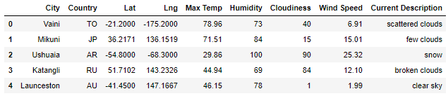

# World_Weather_Analysis
World_Weather_Analysis Module 6

## Overview of Project

PlanMyTrip is looking to take their app to the next level.  They would like to add the weather description to the data we collected for them.  We will create input statements for Beta testers to filter the data with their weather preferences to identify travel destinations and nearby hotels.  From this new list of data the Beta testers will select four cities to create a travel itinerary that will use the Google Maps Directions API to provid them with a travel route between the four cities as well as a marker layer map.

## Resources:

Data Source: [WeatherPy_Database.csv](Weather_Database/WeatherPy_Database.csv), [WeatherPy_vacation.csv](Vacation_Search/WeatherPy_vacation.csv)
 
Software: Jupyter Notebook, Anaconda 4.10.1, Python 3.7.6, Visual Studio Code, 1.56.0
 
Code: [Weather_Database.ipynb](Weather_Database/Weather_Database.ipynb), [Vacation_Search.ipynb](Vacation_Search/Vacation_Search.ipynb), [Vacation_Itinerary.ipynb](Vacation_Itinerary/Vacation_Itinerary.ipynb)

## Weather Database

See the below figure for a sample Datebase created from randomly generated latitudes and longitudes.

## Vacation Search

See the below figure for a Datebase created from Beta tester's desired minimum and maximum temperatures.  

With this Database we can create a World Map with markers showing the locations.

## Vacation Itinerary

Below is the Beta tester's travel route and another world map showing the area and map markers of the cities. 

## Results

- With these new upgrades to the PlanMyTrip app the users can now easily choose a vacation destination that suits their ideal temperature and weather.  We have also allowed them to generate a travel itinerary to see if their dream vacation fits their timeframe.  With the success of the new upgrades we can expand on the the amount of cities to add to the itinerary.
